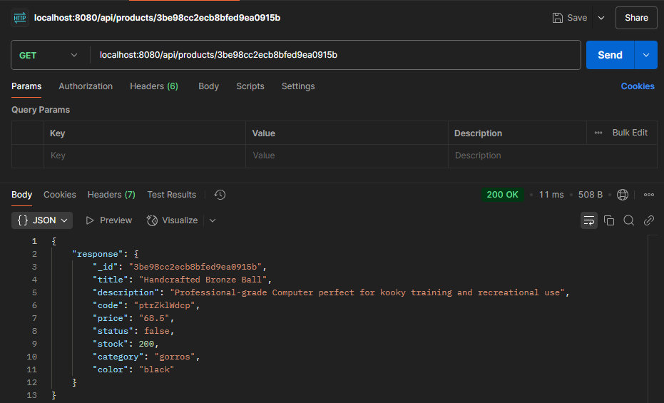
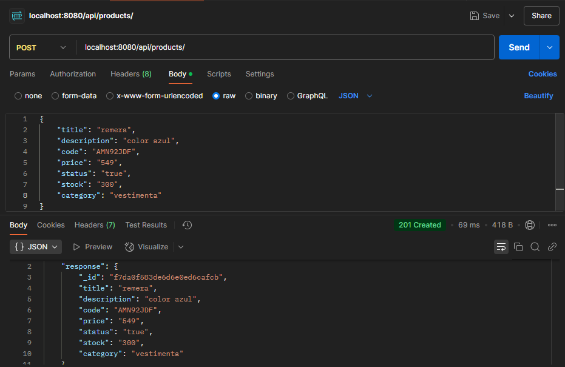
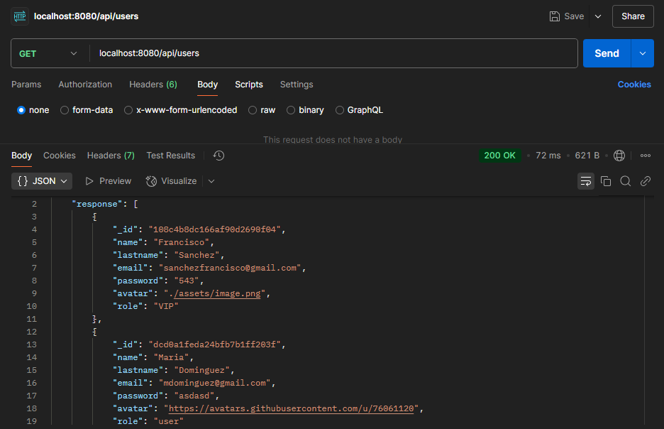
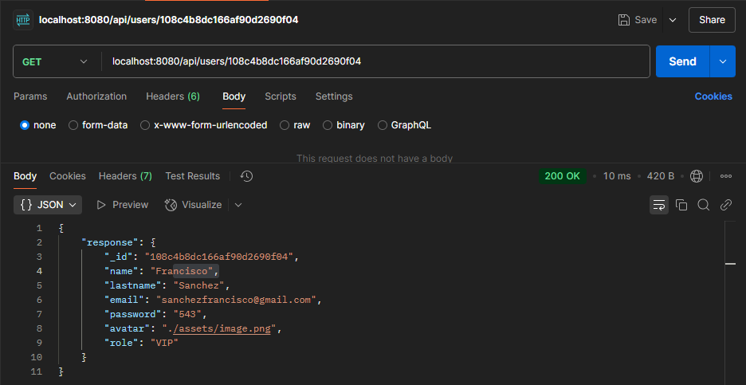
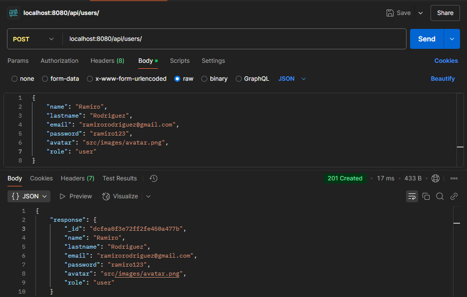

# BackEnd-SanchezFrancisco

Esta es la primera entrega de mi proyecto que forma parte del curso de Programación Backend I, de CoderHouse.

El proyecto consiste de una API, la cual permite gestionar los datos de un e-commerce, teniendo funciones como crear y guardar productos, mostrar los productos, actualizarlos y eliminarlos de la base de datos. A su vez posee las mismas funcionalidades para la gestión de usuarios.

De momento el carrito de compras, donde se guardarán los productos elegidos por el usuario, no tiene funcionalidad. Si bien algunas funcionalidades están desarrolladas, todavia no las implementé a todas.

El proyecto utiliza NodeJS como entorno de ejecución. La instalación de las dependencias se realizaron a traves de NPM, siendo las dependencias utilizadas: 
-Express, para la creación del servidor, el cual se comunicará con el cliente.
-Morgan, para el registro de las solicitudes.
-FileSystem, para la persistencia de datos en archivos.
-Faker, para la creación de datos aleatorios para los productos y usuarios.

# Modo de Uso

Quien quiera probar el programa, deberá previamente tener instalado NodeJS, para poder realizar correctamente la instalación de las dependencias. También deberá tener Postman instalado, ya que de momento no posee implementación visual, y el testeo de la misma solo se puede realizar desde Postman.

Podrá clonar el repositorio, utilizando el comando: "git clone https://github.com/FSNCHZ/BackEnd-SanchezFrancisco", en la terminal. O bien puede ingresar a la página "https://github.com/FSNCHZ/BackEnd-SanchezFrancisco" y descargar los archivos directamente de GitHub.

Una vez ingresado al proyecto, deberá instalar las dependencias correspondientes utilizando el comando:
"npm install" o "npm i"

Para inicializar el servidor, se deberá ingresar el comando:
"npm run dev"

Para verificar que el servidor inició, en la terminal debe salir un mensaje como este:
"Server ready on port 8080"

La ruta "localhost:8080" es la ruta principal, y servirá para poder trabajar con las distintas rutas que nos permitiran acceder a las distintas funcionalidades. Se puede ingresar en el navegador web, donde nos dará un mensaje de bienvenida, indicando que el servidor está funcionando.

La ruta "localhost:8080/api" es la ruta de donde partirán las distintas funcionalidades.

# PRODUCTOS

*Se recomienda utilizar Postman para poder probar todas las funciones del programa

Ingresando "localhost:8080/api/products", con el metodo GET, el servidor nos retornará la lista de todos los productos guardados. Si no hubiese productos guardados, nos devolverá un mensaje diciendo que no hay productos para mostrar

Ingresando "localhost:8080/api/products/:pid", donde ":pid" es el id de algun producto listado, con el metodo GET, nos devolverá ese producto. Si no existiese el producto, nos devolverá un error diciendo que el producto no existe

Ingresando "localhost:8080/api/products", con el metodo POST, e ingresando los datos en el body de Postman (title, description, code, price, status, stock, category, photo), nos permitirá crear un nuevo producto y guardarlo. Las propiedades title, stock y category son obligatorias, y el programa nos pedirá que volvamos a ingresar en caso de que no hayamos enviado nada. El resto de propiedades no son obligatorias, y algunas se crean automaticamente.

Ingresando "localhost:8080/api/products/:pid", con el metodo PUT, e ingresando datos en el body de Postman, podremos modificar los datos de un producto segun el "pid" dado. Si quisieramos modificar el Id, el programa nos enviaría un error diciendo que este no se puede modificar

Ingresando "localhost:8080/api/products/:pid", con el metodo DELETE, podremos eliminar el producto segun el "pid" dado.

# USUARIOS

Ingresando "localhost:8080/api/users", con el metodo GET, el servidor nos retornará la lista de todos los usuarios guardados. Si no hubiese usuarios guardados, nos devolverá un mensaje diciendo que no hay usuarios para mostrar

Ingresando "localhost:8080/api/users/:uid", donde ":uid" es el id de algun usuarios listado, con el metodo GET, nos devolverá ese usuarios. Si no existiese el usuarios, nos devolverá un error diciendo que el usuario no existe

Ingresando "localhost:8080/api/users", con el metodo POST, e ingresando los datos en el body de Postman (name, lastname, email, password, avatar y role), nos permitirá crear un nuevo usuario y guardarlo. Las propiedades name, lastname y email son obligatorias, y el programa nos pedirá que volvamos a ingresar en caso de que no hayamos enviado nada.

Ingresando "localhost:8080/api/users/:uid", con el metodo PUT, e ingresando datos en el body de Postman, podremos modificar los datos de un usuario segun el "uid" dado.

Ingresando "localhost:8080/api/users/:uid", con el metodo DELETE, podremos eliminar el usuario segun el "pid" dado.