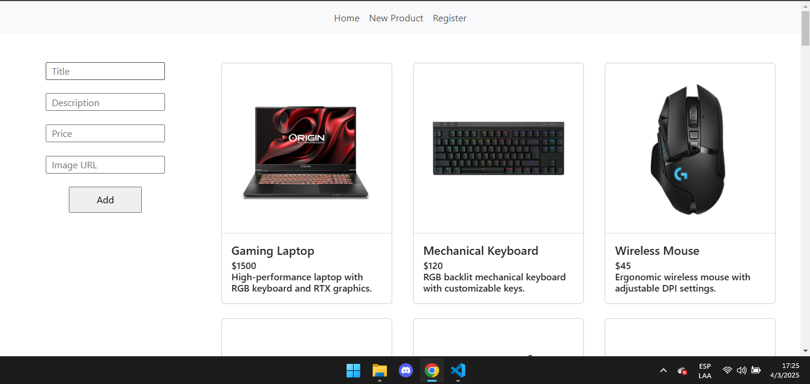

# BackEnd - Sanchez Francisco
Esta es la entrega del proyecto final del curso de Programación BackEnd I de CoderHouse. El proyecto consiste en una API de un e-commerce de productos de computación.
Se utilizarón las tecnologías NodeJS como entorno de ejecución, Express.js para la creación del servidor, como tambien para el manejo de rutas con router-express. Se utilizan middlewares para el manejo de errores, rutas y validación de productos y usuarios
El proyecto cuenta con dos persistencias de datos: persistencia en archivos, utilizando fileSystem y guardando los datos en archivos .json; y persistencia en base de datos, utilizando el servidor de MongoDB.
Se utilizo el motor de plantillas Handlebars para la creación de vistas.
Cabe aclarar que los datos que se muestran en las vistas son aquellos que se utiliza fileSystem para guardarlos. Mientras que los datos guardados en MongoDB se acceden a través de aplicaciones como Postman, que se utilizan para testear API's.
Tambien el manejo de productos en el carrito de las plantillas no se pudo hacer.

Quienes deseen probar el proyecto deberán clonar el repositorio de Github, utilizando en una terminal el comando:

git clone https://github.com/FSNCHZ/BackEnd-SanchezFrancisco.git

Una vez clonado el proyecto, se deberá utilizar los comandos de NPM para inicializar el servidor:

npm run start

Si no ocurre ningun error, una vez levantado el servidor, nos avisará con el mensaje "Server ready on port 8080", como también nos avisará que la base de datos está conectada "db connected".

Ya estamos listo para empezar a usar la API.

Si queremos manejarnos a través del sistema de vistas, debemos ingresar a un explorador de internet e ingresar la dirección:

http://localhost:8080

Esta dirección nos mostrará un listado de todos los productos guardados en archivos.

Tendremos 3 items en la barra de navegacion:

-Home: nos dirige a la pagina principal con el listado de productos

-New Product: nos dirige a una pagina donde podremos crear un nuevo producto, y podremos ver como se lista en tiempo real

Podemos ver que si no ingresamos una url de una foto, se nos creará una imagen por defecto, lo mismo si no ingresamos una descripción del producto.
Para la creación de productos en tiempo real, se utilizo socket permitiendo la comunicación bidireccional entre el servido y cliente.
-Register: nos dirige a una pagina donde podremos registrar un nuevo usuario, y guardarlo en persistencia de archivos.

El usuario se guardará en el archivo json de usuarios

Tambien en la pagina Home, cada producto tendra un boton de "Detail", el cual nos mostrará en detalle la descripción del producto, como también nos permitiría agregar el producto al carrito (si estuviera finalizada la función)

Eso es todo en el apartado de las plantillas.

Si queremos acceder a los datos guardados en base de datos debemos tener instalado un programa llamado Postman, el cual nos permitirá realizar peticiones no solamente del tipo GET, sino que tambien POST, PUT, DELETE, etc.

Nos manejaremos principalmente con la url:

http://localhost:8080/api

Donde de ella tendremos 3 rutas:

-products: para trabajar con productos
-users: para trabajar con usuarios
-carts: para trabajar con los carritos de los usuarios

# Products

Si accedemos a la ruta

http://localhost:8080/api/products

a través del metodo GET, se nos mostrará un listado de todos los productos guardados en la DB

a través del metodo POST, podremos crear un nuevo producto y guardarlo en la DB. Cabe aclarar que el "title" es una propiedad requerida, las demás se crean por defecto.
Los datos del producto los debemos pasar a través del body, en formato json

a través del método GET, y pasando como parametro un id de producto, podremos consultar si existe un producto en la DB.

http://localhost:8080/api/products/:pid

a través del metodo PUT, podremos actualizar algun valor del producto, impidiendonos actualizar el id del producto. Debemos pasar el product_id como parametro en la ruta

http://localhost:8080/api/products/:pid

a través del metodo DELETE, podremos eliminar un producto de la DB. Debemos pasar el product_id como parametro en la ruta

http://localhost:8080/api/products/:pid

# Users

Los métodos de los usuarios es parecido al de los productos, solo que accederemos a traves de la ruta

http://localhost:8080/api/users

El metodo GET, nos devolverá los usuarios listados en la DB

El metodo GET, si le pasamos como parametro un user_id, nos permitira consultar si existe un usuarios con esa id en la DB

El metodo POST, nos permitirá crear un usuario y guardarlo en la DB. Las propiedades "email" y "password" son obligatorias, el resto se crean por defecto

El metodo PUT, nos permite actualizar los datos de un usuario, pasando como parametro en la ruta un user_id.

El metodo DELETE, nos permite eliminar un usuario pasando como parametro el user_id

# Carts

Podremos acceder a los métodos de los carritos a través de la ruta

http://localhost:8080/api/carts

El metodo GET, a través de la ruta

http://localhost:8080/api/carts/users/:uid

Nos devolverá todos los productos que estén guardados en el carrito de un usuario

El método POST, a través de la ruta

http://localhost:8080/api/carts

Nos permitirá agregar un producto, al carrito de un usuario, para hacerlo debemos pasar a través del body, el "product_id" y el "user_id".

El método DELETE, nos permitirá eliminar un carrito, pasando como parámetro como el id de un carrito

Finalmente el método PUT, nos permite actualizar la cantidad de un producto de un carrito, donde deberemos pasar el id de un carrito por parametros, y la cantidad a actualizar por el body

Si bien muchas funcionalidades no se pudieron implementar, más adelante seguramente pueda implementarlas. El curso fue de mucha ayuda y me sirvió mucho para aprender sobre el manejo de datos.
Muchas gracias!!